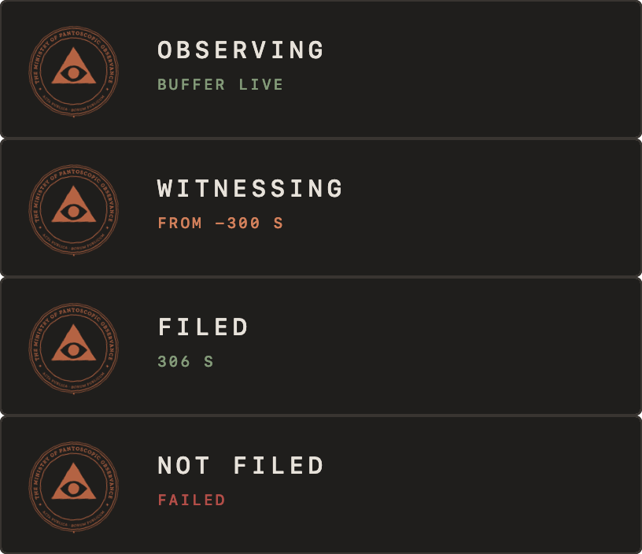
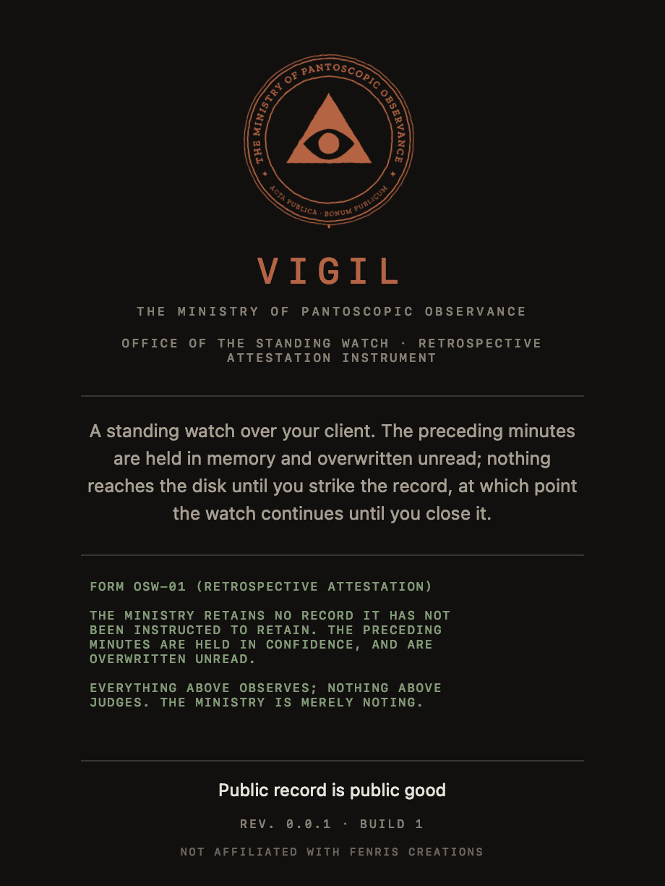
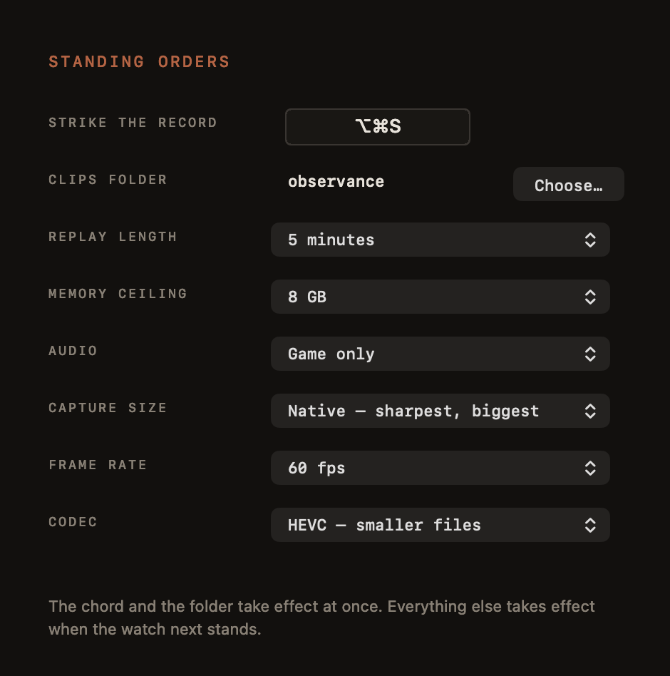

# VIGIL

[](https://www.apple.com/macos/)
[](https://swift.org)
[](LICENSE)


> [Cormorant Fell](https://evewho.com/character/93594488) — WiNGSPAN alumni, wormhole resident, and a man who has lost more good footage than most pilots have recorded — built this. It watches the last five minutes. It writes nothing down. It waits to be asked.

**Office of the Standing Watch · Retrospective Attestation Instrument · Capsuleer Edition**

VIGIL — Latin *vigilia*, a watch kept through the night — is a replay recorder for EVE Online on macOS. It keeps the preceding minutes of your client in memory and puts nothing on the disk. When something happens, you strike the record: the clip opens with everything already held, and keeps recording until you close it.

This is the thing NVIDIA users have had for a decade and Mac pilots have not. No continuous recording, no 40 GB of footage of you sitting in station, no remembering to press record before the tackle lands. The watch is always standing. You only decide, afterwards, that it was worth attesting to.

Single pilot. Local memory. No login, no server, no ESI, no telemetry, no account. VIGIL cannot tell a fleet fight from a screensaver, and is not built to — it observes pixels and sound, and a human decides what mattered.

```
FORM OSW-01 (RETROSPECTIVE ATTESTATION)

THE MINISTRY RETAINS NO RECORD IT HAS NOT BEEN INSTRUCTED TO
RETAIN. THE PRECEDING MINUTES ARE HELD IN CONFIDENCE, AND ARE
OVERWRITTEN UNREAD.

EVERYTHING ABOVE OBSERVES; NOTHING ABOVE JUDGES.
THE MINISTRY IS MERELY NOTING.
```

---



---

## What It Does

**The watch is memory, not disk.** ScreenCaptureKit feeds VideoToolbox, and the encoded frames go into a ring in RAM — five minutes by default, up to fifteen. Nothing is written until you ask. At 1440p a five-minute watch costs about a gigabyte; the ring holds a byte ceiling as well as a time window, because five minutes of a fleet fight is not five minutes of being docked.

**Striking the record reaches backwards.** `⌥⌘S` opens a clip containing everything currently held **and keeps recording live** until you press it again. The buffered past is muxed passthrough — already-encoded frames, copied, never re-encoded — so a five-minute retrospective lands in about ten milliseconds. The ring trims to keyframe boundaries so what you save always begins somewhere legal to decode from.

**Audio is chosen separately from video.** ScreenCaptureKit couples audio selection to video framing, so "the whole display, but only EVE and Discord" is unreachable through it. VIGIL uses a Core Audio process tap instead, which decouples the two: capture the display, and take audio from the game alone, from the game and your comms, or from everything the machine is playing. Fleet footage without comms is usually footage of the wrong thing.

**The record survives EVE quitting.** Dropping to character select kills the client's audio process, and nothing reports it — the tap keeps delivering, it just stops carrying the game. VIGIL watches the audio process list and rebuilds the tap when the client returns. Discord restarting is handled the same way.

**It tells you it heard you.** In fullscreen there is no menu bar to glance at, so the office stamps: a panel at the foot of the screen carrying the seal, the state, and how far back the record reaches. A drawer catches when the record opens; rubber meets paper when it is filed. Both under 160 milliseconds, and neither ever appears in a clip — VIGIL excludes itself from its own capture.

**Nothing is inferred.** VIGIL does not read the overview, watch for combat, parse a log, or decide on your behalf that something was worth keeping. This is deliberate and it is not coming: the moment an instrument derives meaning from what is on your screen, it stops being a recorder. See *Where This Sits With CCP's Rules*, below.

---



---

## Installation

Build it yourself. VIGIL is signed for development, not distribution: it is not
notarised, so Gatekeeper will refuse a copy that arrives from anywhere other
than your own compiler. That is a deliberate deferral rather than an oversight —
a Developer ID is a later problem, and building from source sidesteps it
entirely.

From source:

```
git clone https://github.com/mogglemoss/macobservance
cd macobservance
./bundle.sh
'.build/VIGIL.app/Contents/MacOS/vigil'
```

`bundle.sh` assembles and signs the bundle with whatever codesigning identity you hold. That signature is load-bearing: macOS keys permission grants to it, so an ad-hoc signature makes the system ask again on every rebuild.

Launch the inner binary directly rather than the bundle — you want the
instrument's own reporting in your terminal, and permissions still attribute to
the bundle.

If you move the built `VIGIL.app` somewhere else and macOS refuses to open it,
that is quarantine rather than a broken build:

```
xattr -d com.apple.quarantine /path/to/VIGIL.app
```

Never run that on software whose provenance you cannot vouch for. Here you
compiled it, so you can.

---

## Permissions

Two, both refused silently in their own way.

| Grant | Asked as | If refused |
|---|---|---|
| Screen Recording | a dialog, on first run | VIGIL says so and exits |
| System Audio Recording | a dialog, on first tap | **nothing happens** |

The second is the dangerous one. A denied audio grant is invisible: every Core Audio call returns `noErr` and the buffers are full of zeros. VIGIL measures its own signal level and says so, but check before you fly:

```
'.build/VIGIL.app/Contents/MacOS/vigil' --check --audio all
```

If the office reports `-inf`, the grant is missing. `tccutil reset AudioCapture app.observance.vigil` will make macOS ask again.

---

## Configuration

None required. Undock and run it — a process only enters the tap once it has opened an output stream, so a silent docked client cannot be found.

```
'.build/VIGIL.app/Contents/MacOS/vigil' --audio EVE.app,com.hnc.Discord --length 300
```

Naming processes is harder than it looks, and VIGIL matches three ways because one is never enough. Electron applications never play audio from their main bundle — Discord's sound comes out of `com.hnc.Discord.helper` — so bundle identifiers match as prefixes. And EVE's client reports **no bundle identifier at all**: it runs as `exefile` out of `…/SharedCache/tq/EVE.app`, so an executable name or a path fragment matches too. `--audio game` means the path fragment `EVE.app`, which is why it works wherever you installed it.

`--list` prints every process Core Audio can see, and which are audible right now. Start there when nothing matches.

---

## The Grammar

| Key | Effect |
|-----|--------|
| `⌥⌘S` | strike the record — opens with everything held, keeps recording |
| `⌥⌘S` again | file it |
| `⌥⌘Q` | close the watch (anything open is filed first) |

`⌥` is Option. Both work while EVE holds fullscreen focus, because VIGIL registers them through Carbon rather than an event tap — no Accessibility grant, and the system cannot quietly disable them.

**One watch at a time.** A second instance refuses to start, and names the pid
of the one already standing. This is not tidiness: two instances both capture
the display, which costs real frame rate, and both claim `⌥⌘S` —
`RegisterEventHotKey` grants the second registration without complaint, so the
keypress goes to whichever the window server prefers and you cannot tell which
watch you struck. The claim is an advisory `flock`, so a crash cannot leave a
stale lock that keeps you out. Diagnostics (`--list`, `--check`,
`--overlay-sample`) may still be run alongside a standing watch.

Everything is also in the menu bar, under the office glyph: the state and how much is held, strike and file, the clips folder, Standing Orders, and About. There is no dock icon and no window, so the status item is the only way to reach VIGIL without a hotkey, and the only way out of a lost terminal short of `pkill -f VIGIL`.

| Flag | Effect |
|------|--------|
| `--length <10-1800>` | seconds held in memory (default 300) |
| `--cap <GB>` | hard memory ceiling regardless of length (default 8) |
| `--audio game \| all \| <names>` | who is heard |
| `--scale <0.25-1.0>` | capture size against native backing resolution |
| `--codec hevc \| h264` | h264 if your editor sulks at HEVC |
| `--fps <15-120>` | frame rate |
| `--out <dir>` | default `~/Movies/observance` |
| `--list` | every process Core Audio can see |
| `--check` | run the tap alone for 5 s and report signal |
| `--selftest` | fill the ring, file a record, verify the file, exit |
| `--overlay-sample <dir>` | render the stationery to PNG |

A flag wins for the run it is passed and is **not** written back to the standing
orders. Otherwise trying something once would quietly become permanent.

---

## Standing Orders



The chord and the clips folder are the two a pilot actually has to be able to
override — EVE binds a great many modifier combinations, and nobody wants their
footage in someone else's idea of the right folder. Both take effect
immediately. Replay length, memory ceiling, audio, capture size, frame rate and
codec are there too; those take effect when the watch next stands, because
changing them under a running encoder means restarting the stream, and the sheet
says so rather than pretending otherwise.

A rebound chord must carry ⌘, ⌥ or ⌃. A bare key would fire while you were
typing in local.

## Technical Specifications

| Component | Detail |
|-----------|--------|
| Capture | ScreenCaptureKit · display filter · self excluded · 4:2:0 full range |
| Encoding | VideoToolbox hardware HEVC or H.264 · 1 s GOP · no B-frames |
| Ring | Segmented by format description · measured in PTS · keyframe-aligned trims |
| Ceiling | Time window and byte cap · whole leading GOPs evicted at the cap |
| Saving | Passthrough mux · nothing re-encoded · ~10 ms for five minutes |
| Audio | Core Audio process tap · private aggregate device · PCM in the ring |
| Audio timing | Device nominal rate, not the tap's · gaps paid for in silence |
| Relaunch | Process-list listener · 600 ms coalesce · rebuild on a real change |
| Hotkeys | Carbon `RegisterEventHotKey` · rebindable · no Accessibility grant · fullscreen-safe |
| Settings | `UserDefaults` · flags override for one run without persisting |
| Icon | Seal at 128 and above; the glyph alone below, where the ring text turns to mud |
| Measured | 3024×1964 @ 57.5 fps · 0 dropped · a/v within ±40 ms |
| Network | None. Ever. |
| Auth | None. There is nothing to log into. |

---

## Platform Support

| Platform | Status |
|----------|--------|
| macOS 15+ (Apple silicon) | Yes — developed and measured on an M5 |
| macOS 15+ (Intel) | Should work; untested |
| macOS 26+ | Yes — `processRestoreEnabled` used where available |
| Windows, Linux | No. ScreenCaptureKit and Core Audio taps are Apple's. |

---

## Where This Sits With CCP's Rules

CCP's [Third Party Policies](https://support.eveonline.com/hc/en-us/articles/8564030965660-Third-Party-Policies) draw the line at modifying the client, not at watching the screen. The tolerance is explicit:

> We may, in our discretion, tolerate the use of applications or other software that simply enhance player enjoyment in a way that maintains fair gameplay. For instance, the use of programs that provide in-game overlays (Mumble, Teamspeak) is not something we plan to actively police at this time.

The overlays CCP names there work by hooking the graphics API and injecting into the game process. VIGIL does not. Nothing runs in EVE's address space, no memory is read, no packets are touched, and no cache is scraped. The overlay is a separate window composited by WindowServer; capture is an operating-system framebuffer read, the same as OBS. The hotkey *receives* — nothing is ever synthesised into the client, so the macro clauses do not engage either.

**The constraint that keeps it that way:** VIGIL must never react to game state. No OCR of the overview, no pixel-watching to save automatically, no log parsing. An "auto-clip when combat starts" feature is exactly the thing that would move this across the line, and it is not going to be built.

CCP are clear that none of this is a guarantee — "any use of third party tools is done entirely at your own risk", and they decline to publish a list of approved configurations. This is a reading of the policy, not permission from CCP.

**Publishing the footage** is a separate document: the [Content Creation Terms of Use](https://support.eveonline.com/hc/en-us/articles/8563917741084-EVE-Online-Content-Creation-Terms-of-Use). Advertising revenue is explicitly fine. Paywalling is not — content "must be available free of charge to everyone and cannot be blocked behind a paywall or premium subscription."

---

## A Note on the Record

VIGIL retains the last five minutes. This is not the same as retaining the interesting five minutes, which began somewhere in the twenty before you noticed anything was happening. A fleet fight develops over half an hour; the tackle that mattered landed while you were still aligning. The instrument holds what it holds, and the office declines to pretend otherwise.

The watch is most useful combined with the habit of striking the record early and closing it late, an editor, and the understanding that a perfect capture of a fight you lost is still a fight you lost.

Attest accordingly.

---

## Provenance

- **Approach** — informed by reading [ReplayMac](https://github.com/picccassso/ReplayMac) to understand the problem. No code is shared; that project is source-available rather than open-source, and this is a clean-room implementation against Apple's frameworks.
- **The seal** — the office's own, struck by the estate's render pipeline. It is lifted rather than re-rendered because its ring text is Zilla Slab on a `textPath`, and under a wider fallback SVG silently drops the characters that overrun the path. See [Resources/STRIKE.md](Resources/STRIKE.md).
- **The sounds** — synthesised from arithmetic by [Resources/strike-sounds.py](Resources/strike-sounds.py). No samples, no licences.
- **Stationery** — the Ministry's, per `docs/stationery.md` in the estate: ink, bone, rust, sage, and Geist Mono micro-caps.
- **Sibling instruments** — [VAGARI](https://github.com/mogglemoss/vagari) (chain custody) and [HARUSPEX](https://github.com/mogglemoss/haruspex) (proximity intelligence), from which VIGIL inherits its palette, its packaging, and its institutional temperament.

---

## License

MIT — see [LICENSE](LICENSE)

---

*Built with ScreenCaptureKit, VideoToolbox, and Core Audio. Not affiliated with or endorsed by Fenris Creations. EVE Online and all related marks are the intellectual property of Fenris Creations (formerly CCP hf.).*

---

— [Cormorant Fell](https://evewho.com/character/93594488), whose best fights are all undocumented
